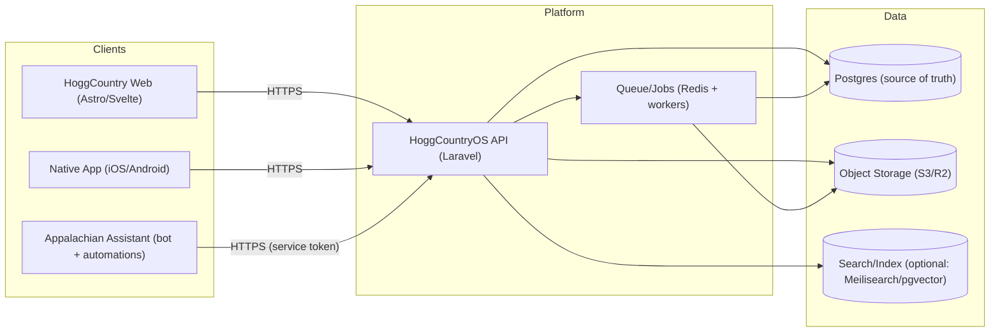

# HoggCountry “Big Picture” Platform Diagram (Draft)

Date: 2026-02-02

This is the current target architecture direction:
- **Web:** Astro + Svelte
- **Native app:** TBD (Expo/React Native vs Swift+Kotlin vs other)
- **Backend:** Laravel (HoggCountryOS API)
- **Queue:** Redis + workers
- **DB:** Postgres (source of truth)
- **Object storage:** Cloudflare R2 (S3-compatible)
- **Search/index:** optional (Meilisearch and/or pgvector)

## Diagram (Mermaid)

## Notes
- Keep **DB as source of truth**; object storage is for blobs (images, GPX, exports, etc.).
- The **Assistant** should call the API using a service token and only expose whitelisted actions.
- Search can start as **Postgres full-text** or **pgvector**, then graduate to Meilisearch if needed.
