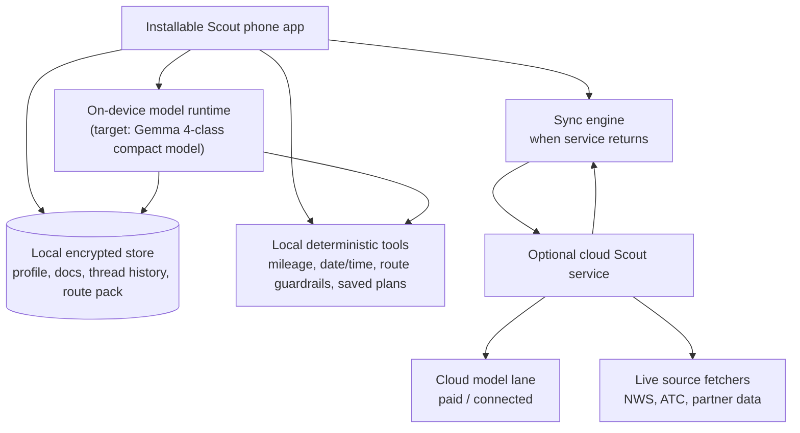

# Scout Local-First Phone AI End Goal

Date: 2026-05-12

## End Goal

Scout should ultimately be an installable phone app that can run useful AI on the hiker's device with no internet connection.

The Appalachian Trail has long stretches with weak or no cellular service. A trail assistant that only works through a cloud model will fail at exactly the moment hikers most need basic planning, safety, weather-context interpretation, gear decisions, and route reasoning. The product direction is therefore local-first: the default useful Scout experience should continue working offline on phones powerful enough to run a compact local model.

The cloud model path remains important, but it is an enhancement, not the foundation. Hikers who want a paid cloud subscription can use stronger cloud models when they have service. When they lose service, the app must fall back to the local model and local data without breaking the core trail workflow.

## Target Shape

Scout should become:

- an installable iOS and Android app
- offline-capable by default
- powered locally by a compact on-device model, with Google Gemma 4 as the intended model family if it proves viable on supported phones
- backed by local trail data, local profile state, local conversation history, and local documents
- optionally connected to cloud models for paid subscribers when internet is available
- able to sync state back to the cloud when service returns

This means the web beta should be treated as a proving ground for the product loop, not the final runtime shape.

## Product Principles

1. Offline first, cloud enhanced.
   The app must answer common trail questions without service. Cloud should improve depth, speed, and advanced reasoning when available, but loss of service should not strand the hiker.

2. The phone owns the field session.
   Conversation history, profile, current mile, local notes, saved plans, downloaded guide data, and the next route segment should be available from local device storage.

3. Paid cloud is optional.
   A subscription can unlock stronger models, heavier research, richer planning, document generation, sync, and concierge escalation. It cannot be required for the baseline trail assistant to function.

4. Current/live sources stay clearly labeled.
   Weather forecasts, alerts, closures, shuttle availability, hostels, and time-sensitive details still require a fresh source. Offline Scout can explain that the last synced data is stale and avoid pretending it has live certainty.

5. Safety beats fluency.
   A smaller local model should be constrained by deterministic tools, local source receipts, route guardrails, and conservative fallback behavior. The answer should be useful and honest rather than expansive and wrong.

## Runtime Architecture

## Offline Capability Tiers

### Offline baseline

Works with no cell service:

- chat with Scout using the local model
- read and search downloaded field guide / route pack
- use profile, current mile, target pace, food-carry limits, and saved plans
- retain conversation history per user
- revise local saved plans
- reason about route shape and rough mileage from downloaded trail data
- explain missing freshness for weather, closures, and town logistics
- record notes, check-ins, symptoms, and location updates for later sync

### Online free/beta

Works when service is available:

- sync profile, docs, and conversation history
- fetch current weather, alerts, closures, and updated public trail context
- use server-side deterministic tools
- back up field notes

### Paid cloud subscription

Works when service is available:

- use stronger cloud models
- longer-context trip planning and document work
- richer source retrieval and synthesis
- concierge handoff / human escalation
- multi-device sync and cloud backups

When service is unavailable, paid users still fall back to the local model and local store.

## Implementation Phases

### Phase 1: Harden the web beta

Keep using the SvelteKit/OpenClaw beta to prove the Scout interaction loop:

- per-user workspace history
- profile and current-mile updates
- source receipts
- weather/current-date grounding
- saved plans and docs
- route guardrails
- quick beta logins for real trail testing

This phase is about product correctness, not final deployment shape.

### Phase 2: Local-first data contract

Extract the app state into a portable local schema:

- profile
- settings and entitlements
- local conversation threads
- saved plans/docs/resources
- downloaded route packs
- source receipts and freshness timestamps
- queued offline mutations

The same schema should work in the web beta, the installable app, and sync services.

### Phase 3: On-device model prototype

Build a proof of concept phone runtime:

- local model loading and availability checks
- small prompt format tuned for Scout
- deterministic local tool calls around date/time, route pack, profile, and saved docs
- memory budget and latency testing on real phones
- clear unsupported-device behavior

Gemma 4 is the preferred model family target, assuming the final model size, licensing, runtime support, and device performance fit the product. If not, keep the architecture model-agnostic and choose the smallest model that meets field reliability standards.

### Phase 4: Installable app shell

Package Scout as a real phone app:

- iOS and Android install
- offline local store
- local model runtime
- background-safe sync
- account switching
- downloaded trail packs
- battery-aware behavior
- degraded-mode UX for old or underpowered phones

The current recommendation remains SvelteKit plus Capacitor unless testing shows native model runtime, storage, or battery constraints require deeper native integration.

### Phase 5: Cloud subscription lane

Add paid cloud capabilities without making the product cloud-dependent:

- cloud model provider routing
- entitlement checks
- cloud sync and backup
- concierge escalation
- explicit online/offline model status
- user-facing transparency about what was local, synced, or live-fetched

## Key Design Requirements

### Model routing

Scout needs a model router with three states:

- `local`: offline-capable phone model
- `cloud`: paid or connected cloud model
- `unavailable`: no usable model, so only deterministic tools and saved docs are available

The UI should show this plainly. A hiker should know whether Scout is using local offline AI or a cloud model.

### Source freshness

Every time-sensitive source needs a freshness timestamp:

- weather forecast
- active alerts
- trail closures
- town/service info
- partner/hostel/shuttle notes
- downloaded route pack version

Offline answers can use the last synced source only if Scout says when it was last synced and whether it may be stale.

### Per-user persistence

Each user must retain separate local and synced state:

- conversation history
- profile
- GPS/current-mile history
- saved plans
- notes/resources
- settings
- subscription state

This applies even when two hikers share the same phone during beta testing.

### Local tool discipline

The local model should not free-form everything. It should be wrapped with local deterministic tools for:

- current device date/time
- profile/current-mile lookup
- route and mileage guardrails
- saved-doc search
- downloaded guide search
- stale-source/freshness checks
- offline mutation queue

## Risks

- On-device model quality may be too weak for safety-sensitive reasoning without strong tool constraints.
- Phone memory, battery, heat, and startup latency may limit which devices are supported.
- Gemma 4 availability, licensing, model size, and mobile runtime support must be validated before committing the runtime.
- Offline weather and closures can only be last-known data, never truly current.
- App Store / Play Store packaging and model download size may become product constraints.

## Near-Term Decision

Keep the current Forge/SvelteKit Scout beta moving, but evaluate every new feature against this end-state question:

> Will this still make sense when Scout is an installable local-first phone app that can run without cell service?

If the answer is no, the feature should either be changed now or clearly marked as a cloud-only enhancement.
