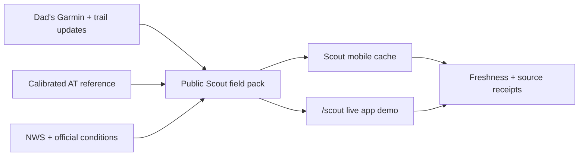

# App-first reliability and live-demo design

## Product rule

Scout is the product. Hogg Country is the public proof: it should demonstrate the same field pack, current-position logic, freshness rules, and uncertainty language that the phone app uses, centered on Dad's real hike data.

## First implementation slices

1. **Truthful field state**
   - A nearby shelter is "next shelter" until the hiker explicitly selects a destination.
   - A check-in says exactly what happened: recorded locally, backed up when sync succeeds, and not sent to the family circle unless the hiker chooses the separate message action.
   - Age labels advance on a shared minute clock so stale information cannot look permanently fresh.

2. **Reliable offline state**
   - "Offline ready" means the field pack was durably written and verified, not merely fetched into memory.
   - Service-worker installation has a small required shell; large or optional references cache independently and cannot prevent the app from installing.
   - The last verified pack remains usable when a refresh or persistence attempt fails.

3. **Private web-app state**
   - Authenticated API responses do not enter a URL-only shared runtime cache.
   - Offline snapshots are scoped to the signed-in workspace and rejected after an account change.
   - Logout clears private offline state and authenticated caches.

4. **Dad-backed public demo**
   - `/scout` reads the same public field-pack endpoint as the mobile bootstrap.
   - It shows Dad's actual current mile and the app's next water, shelter, weather, and source/freshness state.
   - Network failure produces an explicit unavailable state and a link to the live journey; no invented fallback is labeled live.

## Data flow

## Error and privacy behavior

- Never describe memory-only data as offline-ready.
- Never use Dad's cached pilot weather for another hiker's personal pack.
- Never cache authenticated response bodies in a cross-account service-worker cache.
- Never hide an upstream outage behind a static demo value.

## Verification

- Add a regression test before each behavior change.
- Run the affected package tests and type checks per batch.
- Run the full repository test suite and production builds before the sprint closes.
- Commit and push only coherent, passing batches to `main`.
